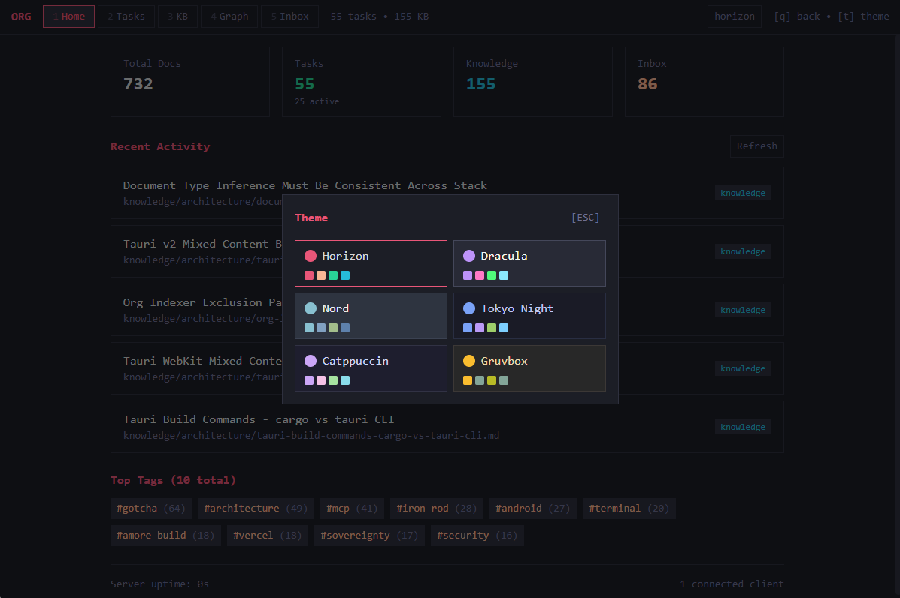

# Org Viewer

A lightweight, personal document viewer for [claude-org](https://github.com/vincitamore/claude-org-template) systems. Runs locally, accessible via Tailscale, installable as a PWA.

> **Note**: This viewer is designed specifically for the claude-org personal organization system. Get started with the [claude-org-template](https://github.com/vincitamore/claude-org-template).


## Features

- **TUI Aesthetic**: Terminal-inspired design with 6 color themes
- **Document Views**: Dashboard, Tasks, Knowledge Base, Inbox, Graph
- **Live Reload**: File changes update the UI in real-time
- **PWA Support**: Install on mobile for native-like experience
- **Keyboard Navigation**: vim-style `j/k` navigation, number keys for views
- **Graph Visualization**: D3-powered document relationship graph
- **Search**: Full-text search with fuzzy matching

### Graph View

Visualize connections between documents based on wikilinks and tags:


### Tag Pages

Auto-generated tag index pages group related documents:


### Themes

Six color themes available via `t` key:



## Quick Start

```bash
# Install dependencies
pnpm install

# Start development
pnpm dev

# Or start server only
pnpm dev:server

# Build for production
pnpm build
```

## Architecture

```
org-viewer/
├── packages/
│   ├── server/       # Bun + Hono backend
│   │   └── src/
│   │       ├── services/  # Document parsing, indexing, file watching
│   │       ├── routes/    # API endpoints
│   │       └── ws/        # WebSocket live reload
│   └── client/       # React + Vite PWA
│       └── src/
│           ├── components/  # TUI-style React components
│           └── lib/         # API client, theme, WebSocket
└── src-tauri/        # Tauri native wrapper (optional)
```

## API Endpoints

| Endpoint | Description |
|----------|-------------|
| `GET /api/files` | List all documents |
| `GET /api/files/:path` | Get single document |
| `GET /api/search?q=...` | Search documents |
| `GET /api/graph` | Get D3 graph data |
| `GET /api/status` | Server/index stats |
| `POST /api/status/reindex` | Force reindex |
| `GET /api/health` | Health check |

## Tailscale Setup

1. Install Tailscale on your machine
2. Start the server: `ORG_ROOT=/path/to/claude-org pnpm dev:server`
3. Access via Tailscale hostname: `http://your-machine:3847`
4. Install as PWA on mobile devices

## Configuration

Environment variables:

| Variable | Default | Description |
|----------|---------|-------------|
| `PORT` | 3847 | Server port |
| `ORG_ROOT` | `cwd` | Path to claude-org root |
| `STATIC_DIR` | `../client/dist` | Path to built client |

## Keyboard Shortcuts

| Key | Action |
|-----|--------|
| `1-5` | Switch views |
| `q` / `Esc` | Go back |
| `j` / `↓` | Next item |
| `k` / `↑` | Previous item |
| `Enter` | Open selected |
| `t` | Toggle theme picker |

## Native App (Tauri)

For a native desktop experience with no external dependencies:

```bash
# Requirements: Rust toolchain + pnpm

# Development (hot reload)
pnpm tauri dev

# Production build (~8MB standalone exe)
pnpm tauri build
```

The built executable is at `src-tauri/target/release/org-viewer.exe`.

**Note:** Always use `pnpm tauri build` (not `cargo build`). This builds the frontend first, then bundles it into the native app.
