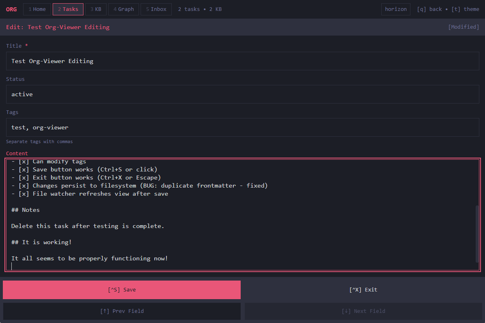

# Org Viewer

A lightweight, personal document viewer for [materia](https://github.com/vincitamore/materia-template) systems. Runs locally, accessible via Tailscale, installable as a PWA.

> **Note**: This viewer is designed specifically for the materia personal organization system. Get started with the [materia-template](https://github.com/vincitamore/materia-template).


## Features

- **TUI Aesthetic**: Terminal-inspired design with 6 color themes
- **Document Editing**: nano-style editor with `e` key, direct filesystem writes
- **Code Editor**: CodeMirror 6 with syntax highlighting for 12+ languages, project file browser
- **Document Views**: Dashboard, Tasks, Knowledge Base, Inbox, Reminders, Graph, Code
- **Reminders**: Time-based reminders with status filtering (pending, snoozed, ongoing, completed, dismissed)
- **Live Reload**: File changes update the UI in real-time
- **PWA Support**: Install on mobile for native-like experience
- **Keyboard Navigation**: vim-style `j/k` navigation, number keys for views
- **Graph Visualization**: D3-powered document relationship graph
- **Search**: Full-text search with fuzzy matching

### Document Editing

Edit documents directly in the viewer with `e` key or click the Edit button:



- **nano-style interface** with keyboard shortcuts
- **Ctrl+S** to save, **Ctrl+X** or **Escape** to exit
- **Tab** to navigate between fields
- Touch-friendly buttons for mobile use
- Changes write directly to filesystem and trigger live reload

### Code Editor

Browse and edit project source code with full syntax highlighting:


- **CodeMirror 6** with 12 language packs (TypeScript, Rust, Python, JSON, CSS, HTML, and more)
- **Project browser** with file tree, type badges, and file sizes
- **Terminal theme integration** — syntax colors match your active theme
- **Inline editing** with `e` to edit, `Ctrl+S` to save, `Escape` to cancel
- **Resizable sidebar** with `Ctrl+B` toggle, width persisted to localStorage
- Press `7` to switch to Code view

### Reminders

Track time-based reminders with status filtering:


- **Status filters**: pending, snoozed, ongoing, completed, dismissed
- **MCP tools**: create, update, complete, dismiss, snooze reminders
- **Session alerts**: Claude alerts you to due/overdue reminders at session start

### Graph View

Visualize connections between documents based on wikilinks and tags:


### Tag Pages

Auto-generated tag index pages group related documents:


### Themes

Six color themes available via `t` key:


## Quick Start

```bash
# Install dependencies
pnpm install

# Start development
pnpm dev

# Or start server only
pnpm dev:server

# Build for production
pnpm build
```

## Architecture

```
org-viewer/
├── packages/
│   ├── server/       # Bun + Hono backend (standalone mode)
│   ├── client/       # React + Vite PWA
│   │   └── src/
│   │       ├── components/  # Dashboard, DocumentList, CodeView, Graph, etc.
│   │       └── lib/         # API client, theme, WebSocket, CodeMirror theme
│   └── mcp/          # MCP server for Claude Code integration
└── src-tauri/        # Tauri native wrapper + embedded Rust/Axum server
    └── src/
        └── server/   # Embedded server (documents, projects, search, graph)
```

## API Endpoints

| Endpoint | Description |
|----------|-------------|
| `GET /api/files` | List all documents |
| `GET /api/files/:path` | Get single document |
| `PUT /api/files/:path` | Update document (frontmatter + content) |
| `GET /api/search?q=...` | Search documents |
| `GET /api/graph` | Get D3 graph data |
| `GET /api/status` | Server/index stats |
| `POST /api/status/reindex` | Force reindex |
| `GET /api/health` | Health check |
| `GET /api/projects` | List project directories |
| `GET /api/projects/:name/tree` | Get file tree for a project |
| `GET /api/projects/:name/file/*path` | Read a project file |
| `PUT /api/projects/:name/file/*path` | Write a project file |

## Tailscale Setup

Access the viewer remotely over your Tailscale network with HTTPS:

### 1. Generate Tailscale TLS certificates

```bash
# Replace with your machine's Tailscale hostname
tailscale cert your-machine.your-tailnet.ts.net
```

This creates two files in the current directory:
- `your-machine.your-tailnet.ts.net.crt`
- `your-machine.your-tailnet.ts.net.key`

### 2. Set environment variables

```bash
# Point to your cert files (absolute paths recommended)
set ORG_VIEWER_TLS_CERT=C:\path\to\your-machine.your-tailnet.ts.net.crt
set ORG_VIEWER_TLS_KEY=C:\path\to\your-machine.your-tailnet.ts.net.key
```

Or create a `.env` file (gitignored):
```
ORG_VIEWER_TLS_CERT=C:\path\to\certs\your-machine.your-tailnet.ts.net.crt
ORG_VIEWER_TLS_KEY=C:\path\to\certs\your-machine.your-tailnet.ts.net.key
```

### 3. Launch the viewer

The native app (or standalone server) will automatically detect the TLS cert env vars and serve over HTTPS. Without them, it falls back to HTTP.

```
# With TLS → https://your-machine.your-tailnet.ts.net:3848 (HTTPS on port+1)
#           + http://localhost:3847 (local WebView, unchanged)
# Without TLS → http://localhost:3847
```

### 4. Access from other devices

Open `https://your-machine.your-tailnet.ts.net:3848` in any browser on your Tailscale network. Install as a PWA on mobile for a native-like experience.

> **Note**: Cert files (`.crt`, `.key`) and the `certs/` directory are gitignored. Never commit TLS certificates.

## Configuration

Environment variables:

| Variable | Default | Description |
|----------|---------|-------------|
| `PORT` | 3847 | Server port |
| `ORG_ROOT` | `cwd` | Path to materia root |
| `STATIC_DIR` | `../client/dist` | Path to built client (standalone mode) |
| `ORG_VIEWER_TLS_CERT` | *(none)* | Path to TLS certificate file (`.crt`) |
| `ORG_VIEWER_TLS_KEY` | *(none)* | Path to TLS private key file (`.key`) |

## Keyboard Shortcuts

### Navigation
| Key | Action |
|-----|--------|
| `1-7` | Switch views (Dashboard, Tasks, Knowledge, Inbox, Reminders, Graph, Code) |
| `q` / `Esc` | Go back |
| `j` / `↓` | Next item |
| `k` / `↑` | Previous item |
| `Enter` | Open selected |
| `t` | Toggle theme picker |

### Document Editor (when editing)
| Key | Action |
|-----|--------|
| `Ctrl+S` | Save changes |
| `Ctrl+X` / `Esc` | Exit editor |
| `Tab` | Next field |
| `Shift+Tab` | Previous field |

### Code Editor (view 7)
| Key | Action |
|-----|--------|
| `e` | Enter edit mode |
| `Ctrl+S` | Save file |
| `Escape` | Exit edit mode |
| `Ctrl+B` | Toggle sidebar |
| `Ctrl+F` | Find in file |

## Native App (Tauri)

For a native desktop experience with no external dependencies:

```bash
# Requirements: Rust toolchain + pnpm

# Development (hot reload)
pnpm tauri dev

# Production build (~17MB standalone exe)
pnpm tauri build
```

The built executable is at `src-tauri/target/release/org-viewer.exe`.

**Note:** Always use `pnpm tauri build` (not `cargo build`). This builds the frontend first, then bundles it into the native app. See the [build process knowledge article](https://github.com/vincitamore/org-viewer/wiki) for deployment details.
